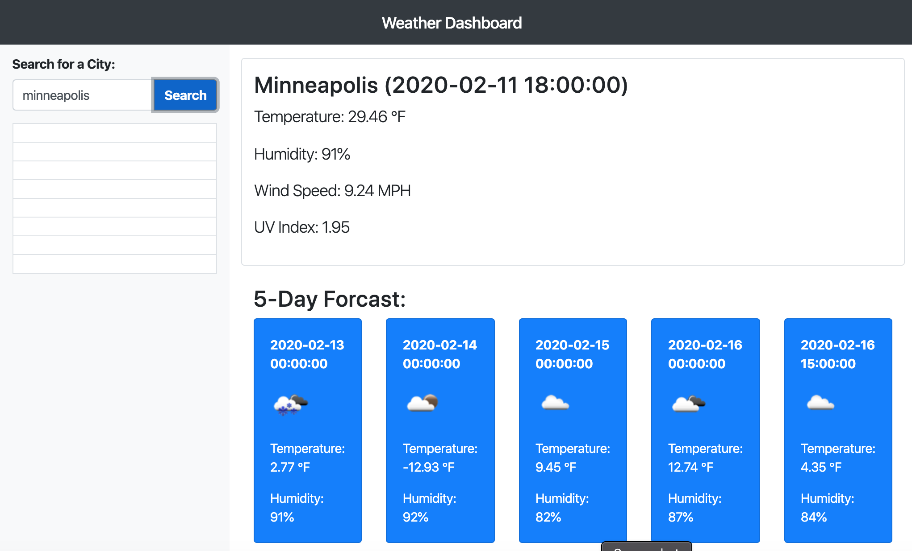

# User Story

As a traveler, I want to see the weather outlook for multiple cities, so that I can plan a trip accordingly.

# Deployed Link: 

https://samanthasengsouvanh.github.io/weather-dashboard/

# Getting Started

The application should pull data from the weather api according to the user's input.

# Screenshots

# Author

Samantha Sengsouvanh - Initial work 

# License

This project is licensed under the MIT License - see the LICENSE.md file for details
